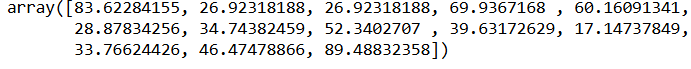

# Implementation-of-Simple-Linear-Regression-Model-for-Predicting-the-Marks-Scored

## AIM:
To write a program to predict the marks scored by a student using the simple linear regression model.

## Equipments Required:
1. Hardware – PCs
2. Anaconda – Python 3.7 Installation / Jupyter notebook

## Algorithm
1. Import necessary libraries such as pandas, matplotlib, and scikit-learn's LinearRegression module.

2. Read the dataset (student_scores.csv) using pandas and extract the independent variable (Hours) and dependent variable (Scores).

3. Visualize the data using a scatter plot to understand the relationship between hours studied and marks scored.

4. Train the linear regression model using LinearRegression().fit(X, y), where X represents the number of hours studied and y represents the corresponding scores.

5. Make predictions using the trained model on the dataset and also predict for new values (e.g., 6.5 hours).

6. Visualize the regression line over the scatter plot to evaluate the model’s performance.

7. Evaluate the model by retrieving the slope, intercept, and predicted values.

8. Display the plot and the prediction results.

## Program:

*Program to implement the simple linear regression model for predicting the marks scored.*<br>
*Developed by: Nanda Kishor S P*<br>
*RegisterNumber: 212224040210*<br>

```python
import pandas as pd
import numpy as np
import matplotlib.pyplot as plt
#import libraries to find mae, mse
from sklearn.metrics import mean_absolute_error, mean_squared_error
#read csv file
df=pd.read_csv("student_scores.csv")
#displaying the content in datafile
df.head()
```

```python
# Segregating data to variables
X = df[["Hours"]]
y = df["Scores"]
```

```python
#splitting train and test data
from sklearn.model_selection import train_test_split
X_train, X_test, y_train, y_test = train_test_split(X, y, test_size=0.5, random_state=42)
```

```python
#import linear regression model and fit the model with the data
from sklearn.linear_model import LinearRegression
model = LinearRegression()
model.fit(X, y)
y_pred = model.predict(X_test)
```

```python
#displaying predicted values
y_pred
```

```python
#displaying actual values
y_test
```


```python
#graph plot for training data
plt.scatter(X_train, y_train, color="blue", )
plt.plot(X_train, model.predict(X_train), color="red")
plt.xlabel("Hours")
plt.ylabel("Scores")
plt.title("Hours vs Scores - Training Data")
```

```python
#graph plot for test data
plt.scatter(X_test, y_test, color="blue", )
plt.plot(X_test, model.predict(X_test), color="red")
plt.xlabel("Hours")
plt.ylabel("Scores")
plt.title("Hours vs Scores - Test Data")
```

```python
#find mae,mse,rmse
mae = mean_absolute_error(y_pred, y_test)
print(f"The MAE is {mae:.4f}")
mse = mean_squared_error(y_pred, y_test)
print(f"The MSE is {mse:.4f}")
rmse = np.sqrt(mse)
print(f"The RMSE is {rmse:.4f}")
```
## Output:

### Head Values

<br>
###Tail Values

<br>
###X Values

<br>
###Actual Y values

<br>
###Predicted Y values

<br>
###Training Data Graph

<br>
###Test Data Graph

<br>
###Regression Performace Metrics


## Result:
Thus the program to implement the simple linear regression model for predicting the marks scored is written and verified using python programming.
